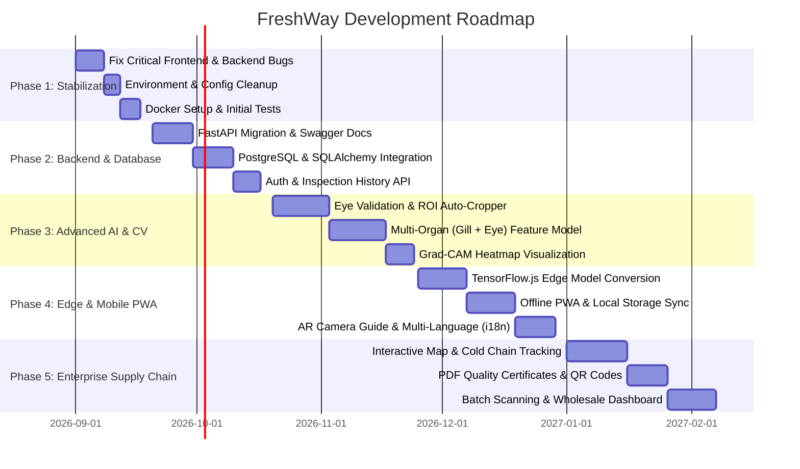

# 🐟 FreshWay — Project Analysis, Architectural Audit & Future Roadmap

> **Document Version:** 1.0.0  
> **Date:** August 2026  
> **Target Audience:** Development Team, ML Engineers, Product Leads & Contributors  
> **Status:** Active Reference Document for Ongoing & Future Development  

---

## 📑 Table of Contents
1. [Executive Summary](#1-executive-summary)
2. [Current Architecture & Tech Stack](#2-current-architecture--tech-stack)
3. [Component-by-Component Deep Dive](#3-component-by-component-deep-dive)
4. [Critical Bugs & Immediate Code Fixes](#4-critical-bugs--immediate-code-fixes)
5. [AI & Computer Vision Enhancements](#5-ai--computer-vision-enhancements)
6. [Backend & System Architecture Enhancements](#6-backend--system-architecture-enhancements)
7. [Frontend & UI/UX Enhancements](#7-frontend--uiux-enhancements)
8. [DevOps, CI/CD & Production Readiness](#8-devops-cicd--production-readiness)
9. [Step-by-Step Phased Implementation Roadmap](#9-step-by-step-phased-implementation-roadmap)
10. [Quick Start & Developer Guide](#10-quick-start--developer-guide)

---

## 1. Executive Summary

**FreshWay** is an AI-powered seafood quality control and supply chain routing platform designed to modernize the fish trade (specifically tailored for coastal seafood hubs like Mangalore, Kerala, and the West Coast of India). 

The platform allows dock workers, quality inspectors, distributors, and retailers to:
- Capture or upload fish eye images.
- Receive instant deep learning-based freshness classification (`Highly Fresh`, `Fresh`, `Not Fresh`).
- Get confidence ratings and automated market routing recommendations (e.g., long-distance premium markets vs. local markets vs. discard).
- Track supply chain contracts, pricing, distances, and delivery histories with fish sellers.

### Key Assessment Findings
| Area | Current Status | Grade | Key Focus for Improvement |
| :--- | :--- | :---: | :--- |
| **Frontend UI/UX** | Modern Next.js 16 App Router UI with Tailwind CSS | **B+** | Fix text/percentage UI bugs, add scan history, camera AR guide, PWA |
| **AI/ML Pipeline** | MobileNetV2 with two-phase fine-tuning and class weights | **B** | Implement eye validation model, multi-organ analysis (eye + gill + skin), edge TF.js |
| **Backend API** | Simple Flask single-endpoint server | **C+** | Migrate to FastAPI, add database (PostgreSQL/SQLite), auth, batch scanning |
| **Supply Chain** | High-fidelity static/mock dashboard UI | **C** | Connect to persistent database, order management, GPS/route mapping |
| **DevOps & QA** | Basic scripts, no unit tests or containerization | **C-** | Add Pytest/Playwright, Docker, GitHub Actions CI/CD |

---

## 2. Current Architecture & Tech Stack

```
                                    ┌──────────────────────────────────────────────┐
                                    │               FreshWay Client                │
                                    │    (Next.js 16, React 19, Tailwind CSS v4)   │
                                    └──────────────────────┬───────────────────────┘
                                                           │
                                                           │ HTTP POST /predict (Multipart Image)
                                                           │ Next.js Rewrite / direct call
                                                           ▼
                                    ┌──────────────────────────────────────────────┐
                                    │             FreshWay Flask API               │
                                    │         (Python 3.11+, Flask-CORS)           │
                                    └──────────────────────┬───────────────────────┘
                                                           │
                                                           │ Image Path (temp/)
                                                           ▼
                                    ┌──────────────────────────────────────────────┐
                                    │              Inference Pipeline              │
                                    │   - Preprocess: 224x224, [-1, 1] scaling     │
                                    │   - MobileNetV2 Model (.keras)               │
                                    │   - Confidence Gating (< 60% threshold)      │
                                    │   - Market Routing Business Logic            │
                                    └──────────────────────────────────────────────┘
```

### Technology Breakdown
- **Frontend:** Next.js 16.1.6, React 19.2.3, TypeScript 5, Tailwind CSS v4, PostCSS.
- **Backend:** Python 3.11, Flask, Flask-CORS, Pillow (PIL), NumPy.
- **Deep Learning:** TensorFlow 2.x, Keras, MobileNetV2 (ImageNet weights, custom Dense classification head).
- **Models:** `freshness_model_best.keras` & `freshness_model_final.keras` (26 MB each).

---

## 3. Component-by-Component Deep Dive

### 3.1 Frontend (`freshway/client`)
- **`app/page.tsx` & `components/LandingPage.tsx`:** High quality hero section with animated intersection counters (`useCounter`), features grid, process steps, interactive preview card, and responsive navbar.
- **`app/dashboard/page.tsx`:** Portal page with entry points into Freshness Detection and Supply Chain modules.
- **`app/capture-img/page.tsx`:** WebRTC camera integration (`getUserMedia`) with mobile environment camera support, image upload, canvas frame capture, and modal results display.
- **`app/supply-chain/page.tsx`:** Searchable, filterable, and sortable seller directory with detail modals, ratings, pricing, and contract statuses.
- **`app/about/page.tsx`, `app/contact/page.tsx`, `app/how-it-works/page.tsx`:** Static informational and contact forms.

### 3.2 Backend (`freshway/server`)
- **`app.py`:** Provides `/predict` (POST) and `/health` (GET). Saves uploads into `temp/` and removes after inference.
- **`inference/predict.py`:** Lazy-loads the Keras model, handles inference, computes per-class probabilities, enforces the 60% confidence gate, and calls routing.
- **`inference/preprocess.py`:** Scales images to `224x224` and applies MobileNetV2 `preprocess_input` (scaling $[-1, 1]$).
- **`business_logic/routing.py`:** Rule-based routing mapping freshness classes to geographical destinations (`Highly Fresh` $\rightarrow$ Bangalore, `Fresh` $\rightarrow$ Mysore, `Not Fresh` $\rightarrow$ Local/Reject).
- **`training/train_freshness_classifier.py`:** Two-phase transfer learning script with data augmentation, class weighting for imbalance, and checkpoint/resume support.
- **`training/train_eye_validation.py`:** *Currently unimplemented placeholder (`pass`).*

---

## 4. Critical Bugs & Immediate Code Fixes

The following bugs were identified during the codebase audit and should be resolved as priority zero:

### 🐛 Bug 1: Object-as-CSS-Class in Result Display (`capture-img/page.tsx:301`)
- **Issue:** `getFreshnessColor(result.freshness)` returns `{ bg: string, text: string, icon: string }`. Line 301 injects `${getFreshnessColor(result.freshness)}` directly into `className`, resulting in `class="text-2xl font-bold [object Object]"`.
- **Fix:**
```tsx
// Before:
<p className={`text-2xl font-bold ${getFreshnessColor(result.freshness)}`}>

// After:
<p className={`text-2xl font-bold ${getFreshnessColor(result.freshness).text}`}>
```

### 🐛 Bug 2: 100x Percentage Display & Progress Bar Overflow (`capture-img/page.tsx:311, 315`)
- **Issue:** The backend `predict.py` already returns confidence formatted as percentage `0 - 100` (e.g. `85.3`). In `capture-img/page.tsx`, lines 311 and 315 multiply this by 100 again, rendering `8530.0%` and `width: 8530%`.
- **Fix:**
```tsx
// Line 311:
<span className="font-bold">{Number(result.confidence).toFixed(1)}%</span>

// Line 315:
<div
  className="h-full rounded-full bg-gradient-to-r from-[#3a7bd5] to-[#00d2ff] transition-all duration-700"
  style={{ width: `${Math.min(100, Math.max(0, result.confidence))}%` }}
/>
```

### 🐛 Bug 3: Duplicate Canvas Blob Conversion (`capture-img/page.tsx:92-108`)
- **Issue:** `capturePhoto()` calls `canvas.toBlob()` twice in a row with different file names (`captured_fish_eye.png` and `captured-photo.png`), creating redundant execution.
- **Fix:** Consolidate into a single clean callback that sets both the `File` object and preview data URI.

### 🐛 Bug 4: Insecure Temporary File Handling & Race Conditions (`server/app.py:28-29`)
- **Issue:** `image.save(os.path.join("temp", image.filename))` uses raw client filenames. If two users upload `image.png` simultaneously or a malicious user supplies `../../evil.sh`, file collision or directory traversal can happen.
- **Fix:**
```python
import uuid
from werkzeug.utils import secure_filename

ext = os.path.splitext(secure_filename(image.filename))[1] or ".jpg"
unique_filename = f"{uuid.uuid4().hex}{ext}"
image_path = os.path.join("temp", unique_filename)
image.save(image_path)
```

### 🐛 Bug 5: Hardcoded Backend URL & Proxy Bypass (`capture-img/page.tsx:149`)
- **Issue:** The client hardcodes `fetch("http://localhost:5000/predict")` instead of using the configured `/api/predict` Next.js rewrite or `process.env.NEXT_PUBLIC_API_URL`.
- **Fix:**
```typescript
const API_URL = process.env.NEXT_PUBLIC_API_URL || "/api";
const response = await fetch(`${API_URL}/predict`, {
  method: "POST",
  body: formData,
});
```

---

## 5. AI & Computer Vision Enhancements

```
                    ┌───────────────────────────────────────────────────┐
                    │            Uploaded Raw Camera Image              │
                    └─────────────────────────┬─────────────────────────┘
                                              │
                                              ▼
                    ┌───────────────────────────────────────────────────┐
                    │      Stage 1: Object & Eye Detection (YOLOv8)     │
                    │   - Detects fish in frame                         │
                    │   - Crops high-resolution fish eye & gill box     │
                    │   - Rejects non-fish / blurry / dark images       │
                    └─────────────────────────┬─────────────────────────┘
                                              │
                                              ▼
                    ┌───────────────────────────────────────────────────┐
                    │       Stage 2: Multi-Organ Freshness CNN          │
                    │   - Eye Clarity Branch (Cornea/Pupil)             │
                    │   - Gill Color Branch (Red/Pink vs Brown/Gray)    │
                    │   - Skin Mucus/Texture Branch                     │
                    └─────────────────────────┬─────────────────────────┘
                                              │
                                              ▼
                    ┌───────────────────────────────────────────────────┐
                    │     Stage 3: Decision Engine & Explainability     │
                    │   - Combined Freshness Score (0 - 100%; target)  │
                    │   - Estimated Shelf Life (Hours/Days on Ice)      │
                    │   - Grad-CAM Heatmap Visualization Overlay        │
                    │   - Dynamic Market Routing & Pricing Guidance     │
                    └───────────────────────────────────────────────────┘
```

### 5.1 Stage 1: Auto Eye-Crop & Out-of-Distribution Rejection
- **Problem:** Currently, if a user uploads a photo of a desk, dog, or full fish body from far away, MobileNetV2 still outputs a confidence score for "Fresh/Not Fresh".
- **Improvement:** 
  1. Train a lightweight **YOLOv8-Nano** or **MobileNet-SSD** detector to locate the fish head/eye and automatically crop the region of interest (ROI).
  2. Implement binary validation (`train_eye_validation.py`) to reject invalid images with helpful feedback (e.g. *"No fish eye detected. Please align the eye inside the guide frame"*).

### 5.2 Multi-Feature Quality Index (Eye + Gills + Skin)
- In fisheries science (Quality Index Method / QIM), eye clarity is only one of 3 crucial visual organs.
- **Gills Analysis:** Bright red/pink = fresh; brown/grey/mucus = deteriorated.
- **Skin/Scales:** Bright metallic luster = fresh; dull/yellowing = oxidized.
- **Feature Fusion Model:** A multi-input CNN that combines Eye + Gill photos to provide a composite Quality Index; accuracy must be measured on a representative held-out dataset.

### 5.3 Explainable AI (Grad-CAM Visual Heatmaps)
- Generate a Gradient-weighted Class Activation Mapping (Grad-CAM) heatmap over the fish eye.
- Superimpose the heatmap in the UI so inspectors and buyers can see *why* the AI flagged an eye as cloudy or deteriorated.

### 5.4 Edge AI: Client-Side Inference with TensorFlow.js / ONNX Runtime Web
- Convert the trained MobileNetV2 model to **TensorFlow.js (TFJS)** or **ONNX Web format**.
- Enable real-time, zero-latency inference directly in the browser/phone camera feed without sending 5MB image payloads to a backend server.
- Allows fishermen on boats without internet connectivity to inspect fish offline.

### 5.5 Estimated Shelf-Life Prediction (Hours Remaining)
- Map the freshness class and temperature conditions to remaining shelf-life hours (e.g. *"Expected shelf-life: 48–72 hours at 0–2°C with adequate crushed ice"*).

---

## 6. Backend & System Architecture Enhancements

### 6.1 Migration to FastAPI
- Replace Flask with **FastAPI**:
  - Native asynchronous async/await execution for high-concurrency requests.
  - Automatic OpenAPI / Swagger UI interactive documentation at `/docs`.
  - Type-safe request/response validation using **Pydantic v2**.
  - Benchmark request throughput against the Flask implementation before claiming an improvement.

### 6.2 Relational Database & ORM (PostgreSQL / SQLite + SQLAlchemy)
Store inspection data persistently:
- **`inspections` Table:** ID, timestamp, image URL, predicted class, confidence, organ scores, inspector ID, batch ID, GPS coordinates, notes.
- **`sellers` Table:** Complete seller profile, contact info, licenses, contracts, pricing per species, rating history.
- **`batches` Table:** Batch ID, total weight (kg), fish species, source harbor, target market, inspection summary (% fresh vs % rejected).

### 6.3 Batch Inspection API
- Wholesale dock operations receive crates containing dozens to hundreds of fish.
- Add endpoint `POST /predict/batch` accepting multiple images or a short video scan, returning an aggregated batch freshness report and acceptance/rejection percentages.

### 6.4 Automated PDF Quality Certificate Generator
- Provide an endpoint `GET /inspections/{id}/certificate` that renders a branded FreshWay Quality Inspection Certificate with:
  - Timestamp, inspector details, batch ID.
  - Fish photo with Grad-CAM analysis.
  - QR Code linking to online verification page.

---

## 7. Frontend & UI/UX Enhancements

### 7.1 Real-Time AR Camera Guide Box
- Add an interactive SVG/Canvas overlay in `capture-img/page.tsx`:
  - Circular or elliptical eye target frame with crosshairs.
  - Real-time brightness & sharpness check (advises user: *"Too dark"*, *"Too blurry"*, *"Hold steady"*).
  - Haptic feedback (vibration) when photo is captured.

### 7.2 Inspection History & Quality Analytics Dashboard
- Create `/history` and `/analytics` pages with:
  - Historical inspection gallery with search, date filters, and status tags.
  - Visual charts (Recharts / Chart.js) for freshness distribution, rejection rate trends, supplier rankings.
  - CSV / Excel export for compliance reporting.

### 7.3 Interactive Supply Chain Map
- Add interactive Leaflet / Mapbox map in `/supply-chain`:
  - Visual map pins for fishing harbors, cold storage facilities, transport routes, and destination markets.
  - Route calculation with estimated transit time and temperature loss alerts.

### 7.4 Progressive Web App (PWA) & Offline Mode
- Configure `@serwist/next` or `next-pwa` with a Service Worker:
  - Installable on mobile home screens (Android / iOS) like a native app.
  - Offline inspection queue: stores photos locally in IndexedDB when offline and syncs automatically when network reconnects.

### 7.5 Multi-Language Localization (i18n)
- Coastal dock workers and fish sellers require regional languages.
- Add `next-intl` supporting: **English, Kannada (ಕನ್ನಡ), Malayalam (മലയാളം), Hindi (हिन्दी), and Tamil (தமிழ்)**.

---

## 8. DevOps, CI/CD & Production Readiness

### 8.1 Docker Containerization
Create standardized containers for both client and server:
- `docker-compose.yml` to run Frontend, FastAPI backend, and PostgreSQL with a single command: `docker compose up --build`.

### 8.2 Testing Suite
- **Backend:** `pytest` testing `/health`, `/predict` validation, mock model inference, and routing business logic.
- **Frontend:** Jest + React Testing Library for UI components and Playwright for end-to-end user journeys (camera capture to modal result).

### 8.3 GitHub Actions CI/CD Pipeline
- Automated workflow on pull requests:
  - Python linting (`flake8` / `black` / `ruff`).
  - Frontend linting & typechecking (`eslint`, `tsc --noEmit`).
  - Test suites execution.
  - Automatic container image build and deployment to staging.

---

## 9. Step-by-Step Phased Implementation Roadmap



### Detailed Phase Breakdown

#### 🔹 Phase 1: Stabilization & Bug Fixes (Sprint 1 — 2 Weeks)
- [ ] Fix `capture-img/page.tsx` class object interpolation bug.
- [ ] Fix confidence 100x multiplier display and progress bar width bug.
- [ ] Refactor temp file upload to use UUID and sanitized filenames.
- [ ] Standardize API calls via Next.js proxy `/api/predict` with configurable `.env`.
- [ ] Add `Dockerfile` and `docker-compose.yml` for unified local development.

#### 🔹 Phase 2: Database, History & FastAPI (Sprint 2 — 3 Weeks)
- [ ] Migrate `server/` to **FastAPI** with Pydantic schema validation.
- [ ] Set up PostgreSQL / SQLite database with SQLAlchemy models.
- [ ] Create `/history` endpoint and UI page to view past freshness analyses.
- [ ] Implement JWT user authentication (Inspector vs Buyer vs Seller roles).
- [ ] Build dynamic CRUD endpoints for Supply Chain seller management.

#### 🔹 Phase 3: Advanced AI & Computer Vision (Sprint 3 — 4 Weeks)
- [ ] Train binary Eye Detection / Auto-Cropping model (`train_eye_validation.py`).
- [ ] Integrate Grad-CAM explainability heatmap overlay into prediction API.
- [ ] Expand dataset and train multi-input model (Fish Eye + Gill images).
- [ ] Add remaining shelf-life estimation formula based on fish species & ice storage.

#### 🔹 Phase 4: Offline PWA & Edge Inference (Sprint 4 — 3 Weeks)
- [ ] Convert MobileNetV2 model to TensorFlow.js / ONNX Web.
- [ ] Enable client-side in-browser inference for zero network latency.
- [ ] Implement Progressive Web App (PWA) with offline scanning queue.
- [ ] Add camera guide overlay with lighting & blur detection.
- [ ] Implement localization (`next-intl`) for Kannada, Malayalam, and Hindi.

#### 🔹 Phase 5: Enterprise Supply Chain & Analytics (Sprint 5 — 4 Weeks)
- [ ] Build interactive Supply Chain Map (Leaflet / Mapbox) with live route tracking.
- [ ] Implement PDF Quality Inspection Certificate generator with QR code verification.
- [ ] Build Batch Inspection mode for crate-level wholesale auditing.
- [ ] Add comprehensive Quality Analytics & Supplier Benchmark Dashboard.

---

## 10. Quick Start & Developer Guide

### Prerequisites
- Node.js >= 18
- Python >= 3.9 (Virtual Environment recommended)
- Git

### Running Client
```bash
cd freshway/client
npm install
npm run dev
# Accessible at http://localhost:3000
```

### Running Server
```bash
cd freshway/server
# Activate virtual environment
python -m venv .venv
# On Windows:
.venv\Scripts\activate
# On Linux/macOS:
source .venv/bin/activate

pip install -r requirements.txt
python app.py
# API running at http://localhost:5000
```

### Checking Backend Health
```bash
curl http://localhost:5000/health
# Response: {"status": "ok", "message": "FreshWay API is running"}
```

---

*This roadmap and analysis document is saved in the project repository as a living reference. All future feature implementations and bug fixes should refer back to this document to track milestones and maintain architectural consistency.*
