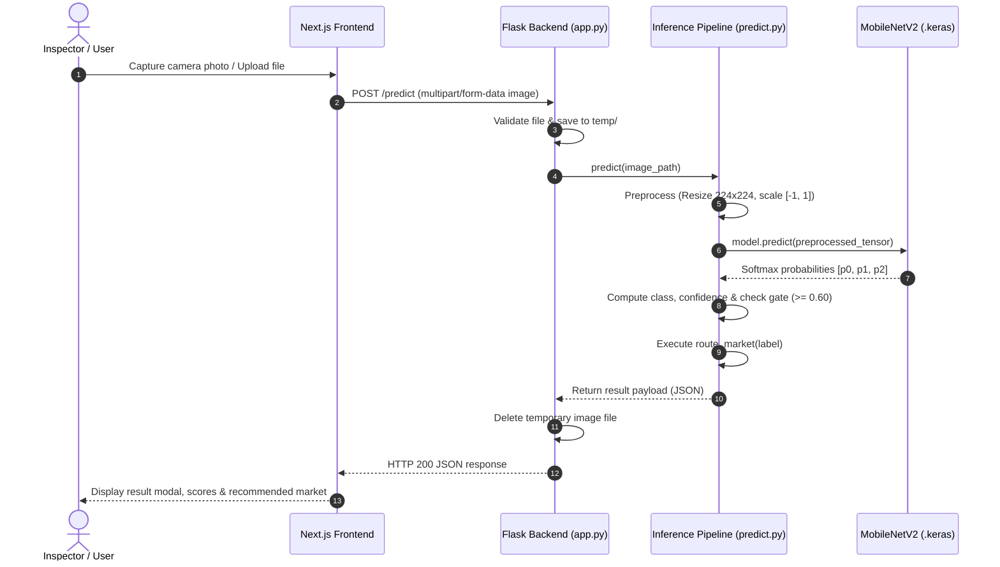

# 🌊 FreshWay — Project Context & System Architecture

> **Last Updated:** 2026-08-25 18:10 (Local Time)  
> **Status:** Active Project Memory  
> **Primary Purpose:** Comprehensive orientation guide for human developers and AI coding agents.

---

## 1. Project Identity

**FreshWay** is an AI-powered computer vision system designed to assess the freshness of fish from close-up photographs of fish eyes, quantify prediction confidence, and provide actionable supply chain routing decisions.

### One-Paragraph Description
FreshWay provides an end-to-end software solution that eliminates subjective and error-prone sensory evaluation of fish in coastal seafood supply chains. By utilizing a transfer-learning deep learning model (MobileNetV2) trained on fish eye imagery, the system takes an uploaded photo or live camera capture, preprocesses the image to standardized dimensions and normalization, runs classification across three freshness categories (`Highly Fresh`, `Fresh`, `Not Fresh`), evaluates confidence against a decision gate, and maps the result to a practical downstream market destination (e.g., long-distance premium transport vs. local market sale vs. disposal).

---

## 2. Problem Statement & Value Proposition

### The Problem
- **Subjective Quality Inspection:** Quality control at fishing harbors, landing centers, and wholesale markets traditionally relies on manual sensory checks (smell, touch, visual eyeball check), which varies widely between individuals.
- **Economic Loss & Post-Harvest Waste:** Delays and inaccurate freshness grading lead to misallocated inventory (e.g., sending borderline-fresh fish on long transit routes where they spoil before arrival, or selling premium fish at discounted local rates).
- **Lack of Laboratory Facilities at Docks:** Chemical (e.g., Total Volatile Basic Nitrogen / TVB-N) and microbiological tests take hours or days and require expensive laboratory equipment not available at landing docks or retail counters.

### The FreshWay Solution
- **Non-Destructive & Instant:** Assesses freshness within seconds from a standard smartphone or web camera photo without damaging or puncturing the fish.
- **Objective & Quantified:** Outputs categorical classification with percentage confidence ratings.
- **Actionable Supply Chain Logic:** Bridges AI inference directly with market routing (e.g. assigning transit radius based on shelf-life potential).

---

## 3. Intended Users & Use Cases

| User Group | Primary Use Case | Key Value |
| :--- | :--- | :--- |
| **Harbor Inspectors & Dock Quality Controllers** | Rapid batch scanning of arriving catches at auction halls. | Standardized grading, reduced inspection bottleneck. |
| **Seafood Wholesalers & Distributors** | Decision-making on cold-chain transit radius (e.g., export vs. interstate vs. local). | Minimizing in-transit spoilage losses. |
| **Retail Fish Markets & Supermarkets** | Pre-sale quality audit and pricing tier verification. | Consumer trust, consistent freshness assurance. |
| **Bulk Buyers & Restaurant Chains** | Quality verification at the point of delivery before signing supplier invoices. | Dispute resolution, automated quality compliance. |

---

## 4. System Boundaries: What FreshWay DOES and DOES NOT Do

### ✅ What FreshWay DOES
- Takes a photograph containing a close-up of a fish eye as input.
- Validates image presence and normalizes dimensions ($224 \times 224$) and pixel ranges ($[-1, 1]$).
- Executes deep learning inference via MobileNetV2 CNN.
- Classifies freshness into one of 3 classes: `Highly Fresh`, `Fresh`, or `Not Fresh`.
- Calculates per-class softmax probabilities and primary confidence score ($0\text{–}100\%$).
- Applies confidence gating (rejection below $60\%$ threshold as `Uncertain`).
- Recommends a business market routing category based on freshness class.
- Provides a web dashboard for camera capture, analysis, and static seller supply chain management.

### ❌ What FreshWay DOES NOT Do
- **Not a generic fish species identifier:** It does not identify whether a fish is a Salmon, Tilapia, Mackerel, or Tuna (although species context is relevant for future shelf-life models).
- **Not a chemical / bacterial sensor:** It does not measure chemical compounds or microbial bacterial colony counts directly; it models optical physical indicators (cornea transparency, lens cloudiness, pupil clarity).
- **Not a full ERP / Payment Gateway:** It does not currently process financial transactions, bank payouts, or live inventory logistics.
- **Not a full-body fish detector (Yet):** Current inference assumes the uploaded image is already focused on the fish eye region.

---

## 5. End-to-End System Workflow



---

## 6. Machine Learning Pipeline Specification

### 6.1 Input Specification
- **Format:** RGB image (JPEG, PNG, WebP).
- **Target Resolution:** $224 \times 224$ pixels.
- **Color Channel Scaling:** MobileNetV2 native scaling:
  $$\text{pixel\_scaled} = \frac{\text{pixel}}{127.5} - 1.0 \quad \in [-1, 1]$$
- **Expected Visual Content:** Close-up photographic image of a fish eye (cornea and pupil visible).

### 6.2 Target Classes & Semantic Definitions
| Class Index | Class Name (Code) | Human-Readable Label | Visual Characteristics | Market Implication |
| :---: | :--- | :--- | :--- | :--- |
| `0` | `fresh` | **Fresh** | Cornea slightly translucent, pupil clear, minimal flattening. | Medium-distance market (e.g., Mysore/regional markets). |
| `1` | `highly_fresh` | **Highly Fresh** | Cornea crystal clear, transparent, convex pupil, bright shine. | Long-distance transport (e.g., Bangalore/interstate) or premium export. |
| `2` | `not_fresh` | **Not Fresh** | Cornea cloudy/opaque, milky white film, sunken pupil, discoloration. | Local clearance / non-food industrial use / discard. |

### 6.3 Confidence Gating Logic
- **Confidence Threshold:** `0.60` ($60.0\%$).
- **Rule:** If $\max(\text{Softmax Probabilities}) < 0.60$:
  - Status is set to `"uncertain"`.
  - Freshness label overridden to `"Uncertain"`.
  - Market route overridden to `"Request better image"`.
  - User prompted to retake the photo with improved lighting and eye focus.

### 6.4 Market Routing Business Logic (`routing.py`)
```python
def route_market(freshness_label: str) -> str:
    if freshness_label == "Highly Fresh":
        return "Long-distance market (e.g., Bangalore)"
    elif freshness_label == "Fresh":
        return "Medium-distance market (e.g., Mysore)"
    elif freshness_label == "Not Fresh":
        return "Local market or reject"
    elif freshness_label == "Uncertain":
        return "Request better image"
    else:
        return "Invalid label"
```

---

## 7. Current Architecture & Repository Organization

```
freshway/
├── AGENTS.md                           # AI agent rules & protocols
├── PROJECT_CONTEXT.md                  # This file (system memory)
├── CURRENT_STATE.md                    # Working reality vs. planned features
├── DECISIONS.md                        # Architecture & ML decision log
├── ISSUES.md                           # Living issues, bugs & technical debt
├── CHANGELOG.md                        # Chronological record of changes
├── PROJECT_ANALYSIS_AND_ROADMAP.md     # Primary design & roadmap document
├── README.md                           # General project documentation & setup
│
├── client/                             # Next.js 16 Frontend Application
│   ├── app/
│   │   ├── page.tsx                    # Landing page entry
│   │   ├── layout.tsx                  # Root layout & font configuration
│   │   ├── globals.css                 # Tailwind CSS styles
│   │   ├── dashboard/page.tsx          # Portal navigation
│   │   ├── capture-img/page.tsx        # Camera/upload capture & inference UI
│   │   ├── supply-chain/page.tsx       # Seller contract management UI
│   │   ├── about/page.tsx              # About & mission page
│   │   ├── contact/page.tsx            # Contact form page
│   │   └── how-it-works/page.tsx       # System explanation & steps
│   ├── components/
│   │   ├── LandingPage.tsx             # Interactive landing hero & sections
│   │   └── Navbar.tsx                  # Navigation bar & mobile menu
│   ├── public/                         # Static assets (bg.png, logo.png)
│   ├── next.config.ts                  # Next.js configuration & API rewrites
│   └── package.json                    # Frontend dependencies
│
└── server/                             # Flask Backend & ML Service
    ├── app.py                          # Flask HTTP server & endpoints
    ├── requirements.txt                # Python dependencies
    ├── business_logic/
    │   └── routing.py                  # Market destination mapping
    ├── inference/
    │   ├── predict.py                  # Model loader & inference coordinator
    │   └── preprocess.py               # Image resizing & MobileNetV2 scaling
    ├── models/
    │   ├── freshness_model_best.keras  # Trained Keras checkpoint (26 MB)
    │   └── freshness_model_final.keras # Trained Keras final model (26 MB)
    ├── training/
    │   ├── train_freshness_classifier.py # 2-phase training with class weighting
    │   └── train_eye_validation.py     # Stub for future eye detector
    ├── utils/
    │   └── image_utils.py              # Placeholder utility functions
    ├── data/                           # Training/validation data directory (gitignored)
    └── temp/                           # Temporary image upload buffer
```

---

## 8. Technology Stack & Key Dependencies

| Layer | Technologies / Libraries | Purpose |
| :--- | :--- | :--- |
| **Frontend Framework** | Next.js 16.1.6 (App Router), React 19.2.3, TypeScript 5 | Responsive web application, routing, UI components. |
| **Styling & Icons** | Tailwind CSS v4, PostCSS | Modern UI styling, animations, responsive design. |
| **Backend Framework** | Python 3.11+, Flask, Flask-CORS | REST API handling multipart upload and inference routing. |
| **Deep Learning Framework**| TensorFlow 2.x, tf.keras, MobileNetV2 | Image classification CNN with ImageNet transfer learning. |
| **Image Processing** | Pillow (PIL), NumPy | Image decoding, array conversion, batch shaping. |

---

## 9. Domain Concepts & Biological Foundations

- **Fish Eye Freshness Correlation:** Fresh fish have clear, convex, transparent corneas with deep black pupils. As post-mortem bacterial action and autolytic biochemical enzymatic breakdown progress, proteins degrade, leading to cornea opacity, milky cloudiness, flattening, and sinking of the eye.
- **Quality Index Method (QIM):** A standardized European and international sensory scoring system for seafood quality. FreshWay's eye analysis aligns with the eye scoring dimension of QIM.
- **Temperature & Cold Chain Dependency:** Fish freshness degrades at a rate directly proportional to storage temperature (governed by the Arrhenius equation). Fish classified as `Highly Fresh` must remain on crushed ice ($0\text{–}2^\circ\text{C}$) to sustain long-distance transport viability.

---

## 10. Important Assumptions & Constraints

1. **Illumination Assumption:** The current classification model assumes reasonably diffuse white lighting. Extreme glare, reflection on the cornea, or deep shadows may cause prediction degradation.
2. **Crop / Scale Assumption:** The current classifier expects the image frame to be predominantly composed of the fish eye. It does not perform full-scene object detection before classification.
3. **Regional Species Bias:** Training dataset images reflect predominantly tropical and subtropical coastal marine fish species (e.g., Mackerel, Sardine, Tuna, Pomfret).
4. **Zero State / Local Persistence:** The backend currently operates statelessly—uploaded images are processed and deleted immediately from `temp/`. No database is currently wired to store historical scans.

---

## 11. Known Safety & Accuracy Limitations

- **Out-of-Distribution Input:** If an image of a non-fish object (e.g., shoe, dog, document) is submitted, the model will output arbitrary softmax distributions across the three freshness classes because `train_eye_validation.py` is not yet active.
- **Single Organ Limitation:** Eye clarity is a primary indicator, but rare anomalies (e.g., physical eye injury during netting on an otherwise fresh fish) can produce false negatives unless supplemented by gill or skin analysis.
- **Confidence Gate Safety Margin:** Low-confidence predictions ($<60\%$) are rejected as `"uncertain"`, safeguarding against borderline classifications.
